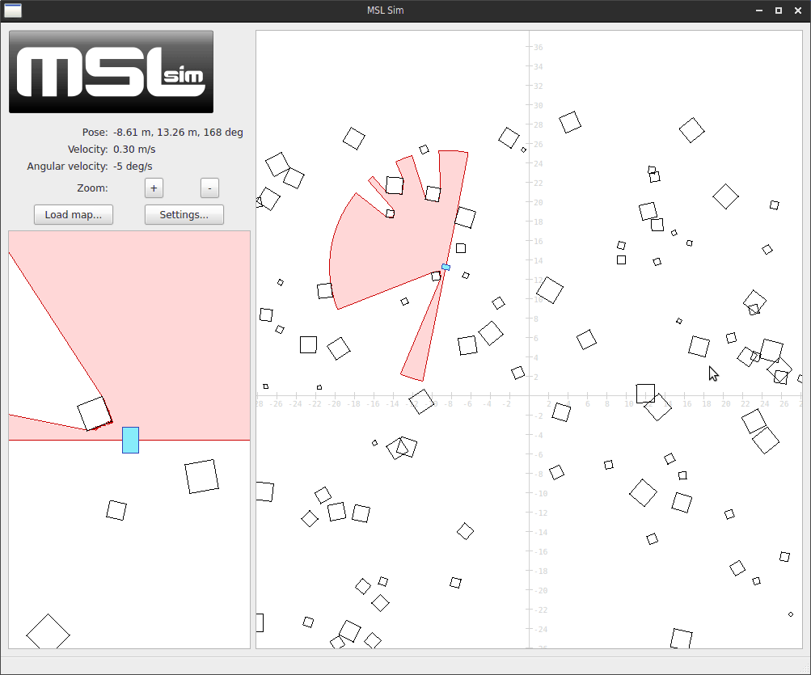
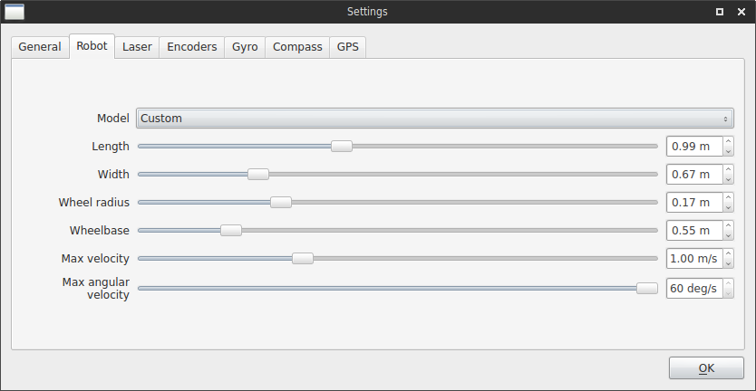
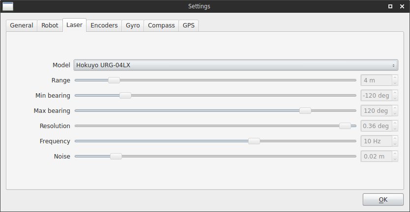
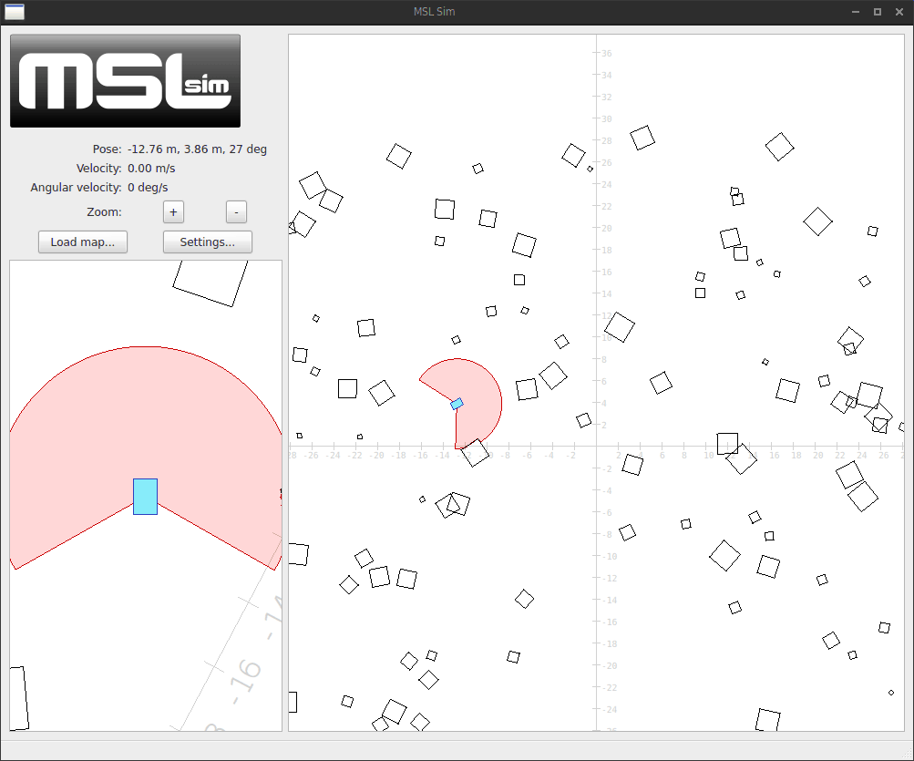

# MSL Simulator
MSL Simulator is a two-dimensional mobile robot simulator designed to be used with the [Robot Operating System (ROS)](http://www.ros.org). Created by [Marc Gallant](http://marcgallant.ca), originally for use in the [Mining Systems Laboratory](http://msl.engineering.queensu.ca). Here is what the MSL Simulator looks like in action:

## Installation

## Basic Usage
The robot (blue rectangle) uses its laser scanner (red semi-circle) as it drives through a randomly generated field of obstacles (squares). The main view-window on the right is a static top down view of the environment, and the secondary view-window on the left is a GPS-like view of the robot coordinate frame. The information panel at the top left displays basic information about the robot and contains buttons to change the zoom level, load a map, or change settings.

### Sensors
The robot is equipped with five sensors: a two-dimensional laser scanner, wheel encoders, a gyroscope, a compass, and GPS. These sensors can be configured by clicking on the "Settings..." button, which brings up this dialog window:

From here you can edit individual settings of the robot and each sensor, or (in some cases) you can pick preset values from real hardware. For example, you can choose the Hokuyo URG-04LX as your laser scanner and it will automatically choose all the right settings:

Note that all changes to the sensor settings occur in *real time*. For example, watch what happens as I adjust some of the laser scanner settings:

## Generating Maps

## Recording Data